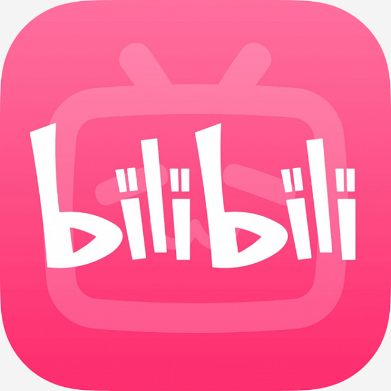
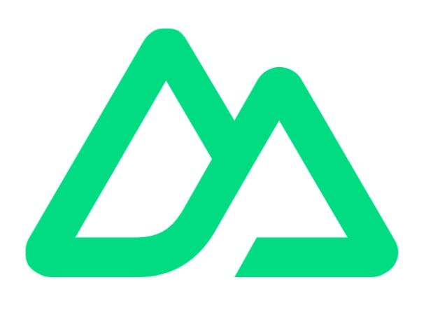
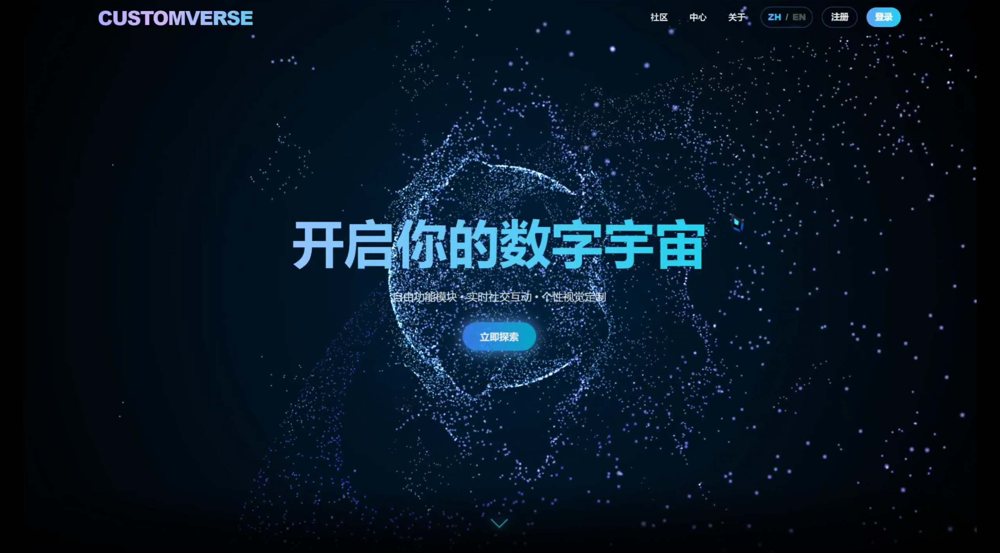

## 全栈开发

👋 你好！我是 Corcky

热爱前端、技术与设计。

## 📱 社交主页

<a href="https://space.bilibili.com/393842136"><code></code></a>bilibili

## 💼 技术栈

<a href="https://v3.cn.vuejs.org"><code></code></a>
<a href="https://reactjs.org"><code></code></a>
<a href="https://nextjs.org/"><code></code></a>
<a href="https://nuxtjs.org.cn/"><code></code></a>
<a href="https://www.tslang.cn/index.html"><code></code></a>
<a href="https://cn.vitejs.dev"><code></code></a>
<a href="https://sass-lang.com"><code></code></a>
<a href="https://tailwindcss.com"><code></code></a>
<a href="https://element-plus.org"><code></code></a>
<a href="https://www.naiveui.com/"><code></code></a>

## 📚 参与项目

## GitHub 活跃度

## 🎓 求职意向

目前 21 岁，应届毕业生，热爱前端、技术与设计。